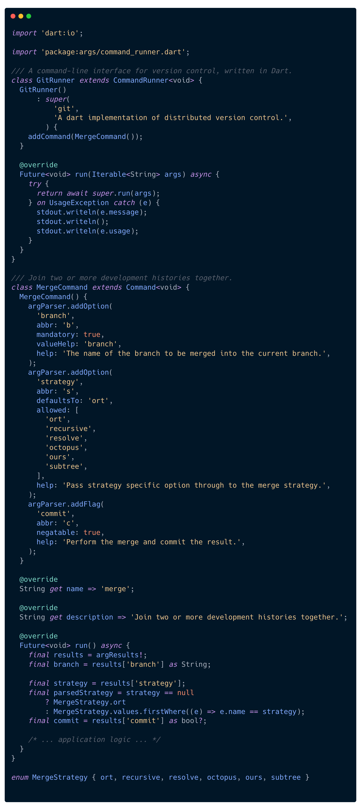
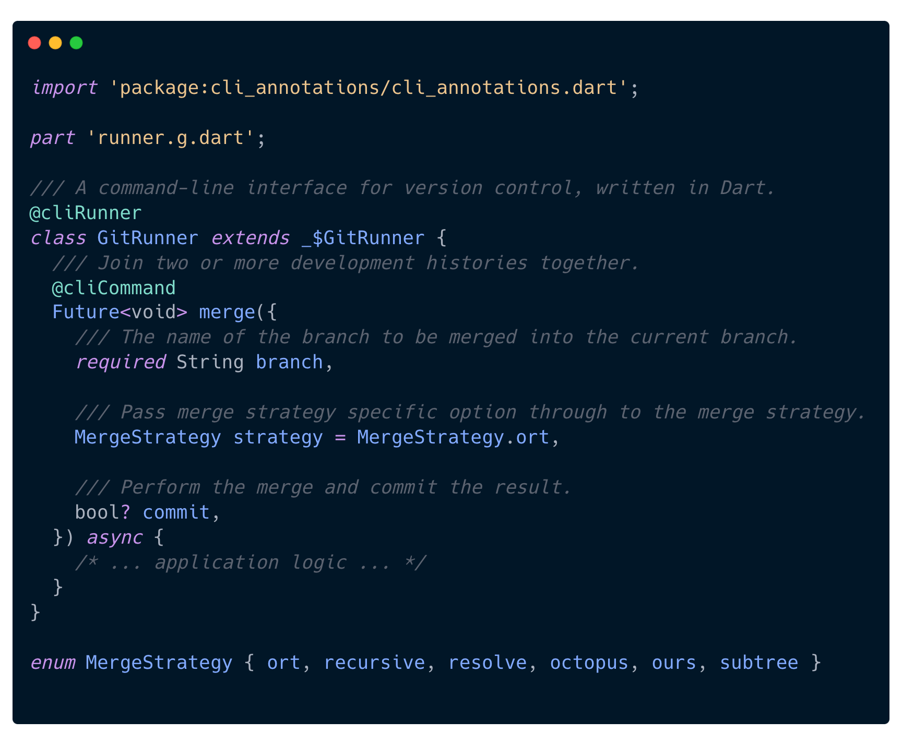

# cli-gen

[](https://github.com/pattobrien/cli-gen/actions/workflows/packages.yml)
[](https://pub.dartlang.org/packages/cli_annotations)

A package for building cli applications using code generation and macros.

## Motivation

<blockquote>
  🚧 This package is in early preview.
</blockquote>

The ability to quickly whip up a CLI application is a powerful skill for a developer to have. Yet the boilerplate of `cli` Dart libraries like `package:args` leave a lot to desire in terms of quickly getting a script up and running.

`cli-gen` aims to be a quality-of-life improvement for creating CLI apps, by providing the following benefits:

- type-safe arguments
- `help` text generation from doc comments and Types
- proper user error output, without stack traces

`cli-gen` makes writing CLI applications in Dart as intuitive as writing any other native Dart function or method, and removes the need to learn the underlying `package:args` semantics.

<table>
<tr>
<th>Before</th>
<th>After</th>
</tr>
<tr>
<td valign="top">

<!--  screenshots are located in docs/before_and_after/screenshots/** (before.png and after.png) -->

[](docs/before_and_after/screenshots/before.png)

</td>
<td valign="top">

[](docs/before_and_after/screenshots/after.png)

</td>
</tr>
</table>

## Table of Contents

- [Motivation](#motivation)
- [Getting Started](#getting-started)
- [Features](#features)
- [Under the Hood](#under-the-hood)
- [Design Goals](#design-goals)
- [Inspiration](#inspiration)
- [License](#license)

## Getting Started

1. Add `cli_annotations` to your `pubspec` dependencies and `cli_gen` and `build_runner` as dev dependencies.

   Optionally, you can define an executable name and activate it using [pub global activate](https://dart.dev/tools/pub/cmd/pub-global#activating-a-package-on-your-local-machine).

```yaml
dependencies:
  cli_annotations: ^0.0.1

dev_dependencies:
  build_runner: ^2.1.0
  cli_gen: ^0.0.1

# define an executable name (optional)
executables:
  dart_cli:
    path: main # file name of `main()` in bin/ directory
```

2. Create a `CommandRunner` by annotating a class with `@cliRunner` and extending the generated superclass (uses the typical `_$` prefix).

```dart
@cliRunner
class GitRunner extends _$GitRunner {
  // ...
}
```

3. Create a `Command` by simply creating a method on the class. Any parameter type will be automatically parsed from string arguments.

```dart
@cliRunner
class GitRunner extends _$GitRunner {
  @cliCommand
  Future<void> merge({
    required String branch,
    MergeStrategy strategy = MergeStrategy.ort,
    bool? commit,
  }) async {
    // ... application logic ...
  }
}
```

4. Alternatively, you can group similar commands under one `Subcommand` by annotating a class with `@cliSubcommand` and extending the generated superclass.

```dart
// Create a `stash` Subcommand
@cliSubcommand
class StashSubcommand extends _$StashSubcommand {
  @cliCommand
  Future<void> push() async { /* ... */ }

  @cliCommand
  Future<void> pop() async { /* ... */ }
}

// Then mount it to the main `CommandRunner` or a parent `Subcommand`
@cliRunner
class GitRunner extends _$GitRunner {
  @mount
  Command get stash => StashSubcommand();
}
```

5. Create a `main` function that runs the `CommandRunner`.

```dart
void main(List<String> arguments) async {
  final runner = GitRunner();
  await runner.run(arguments);
}
```

You're ready to go! Run your application via the command line and see the generated help text and argument parsing in action.

```bash
# activate the executable (if executable is defined in `pubspec.yaml`)
$ dart pub global activate . --source=path

# run the application
$ dart_git merge --help
```

You should see the following output:

```bash
$ dart_git merge --help
Join two or more development histories together.

Usage: git-runner merge [arguments]
--branch (mandatory)
--commit
--options

Run "git-runner help" to see global options.

```

## Under the Hood

`cli-gen` uses `package:args` to manage command hierarchies and help text generation. The annotations included with this package are roughly a 1:1 mapping to similar concepts included with `package:args`, for example:

- `@cliRunner`
  - generates a `CommandRunner` class
  - mounts any nested commands as subcommands via `CommandRunner.addCommand`
- `@cliCommand`
  - generates a `Command` class
  - overrides the `run` method with a call to your method or function
- `@cliSubcommand`
  - generates a `Command` class
  - adds all nested commands as subcommands via `Command.addSubcommand`

Examples of generated code can be found in the `example` project, within their respective `.g.dart` files.

## Features

### ArgParser generation from Parameters

- Generate an ArgParser from a Constructor or Method/Function

  - Auto Argument Parsing (convert a String/bool argument into the expected Dart type, without using annotations to tell the builder what parser to use):
    - [x] Primatives: String, int, double, bool, Uri, DateTime
    - [x] Collections: List, Set, Iterable
      - [ ] Map
    - [ ] User-Defined types:
      - [x] Enums
      - [ ] Classes
      - [ ] Extension Types
  - Multi-Select arguments

    - [ ] List of primative values
    - [ ] enums for a finite list of values

  - `help` comments from doc comments

- annotations to help guide the generator

### Command generation

- [x] Generate a `Command` class using a `@cliCommand` annotation on a method or function
- [x] Generate a `Subcommand` class using a `@cliSubcommand` annotation
- [x] Generate a `CommandRunner` using a `@cliRunner` annotation
  - [x] Allow mounting nested subcommands using a `@mount` annotation

## Design Goals

TODO: write a little blurb about the goals (what `cli-gen` is and what it is not).

## Inspiration

Several projects were researched as references of CLI ergonomics and macro libraries, including:

- [clap](https://docs.rs/clap/latest/clap/) - a declarative CLI parser for Rust

## License

`cli-gen` is released under the MIT License. See [LICENSE](LICENSE) for details.
